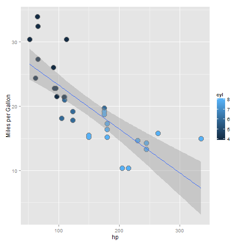

## Analysis of Gas Mileage

### Purpose
- Provides visual exploration of Motor Trend dataset
- Shows relationship of mileage versus other variables
- Displays the linear regression line

### Input
- X-axis can be any mtcars variable chosen from dropdown list
- Point colors for transmission or cylinders

--- .class #id

## the plot


The plots are drawn dynamically as you select your input.

 

--- .class #id 

## ggplot code

Simple ggplot code renders the chart.


```r
       output$thePlot <- renderPlot({
           selectedData = data.frame(mpg = mtcars$mpg, 
                                     var = factor(mtcars[[input$xcol]]),
                                     cyl = mtcars$cyl,
                                     am  = mtcars$am)
           if (input$colorVar == "cyl")
               p = ggplot(selectedData, aes(y = mpg, x = var, colour = cyl))
           else
               p = ggplot(selectedData, aes(y = mpg, x = var, colour = factor(am)))
           p = p + xlab(input$xcol)
           p = p + ylab("Miles per Gallon")
           p = p + geom_point(colour="grey50", size = 5) 
           p = p + geom_point(size = 4)
           p = p + geom_smooth(method=lm, aes(group = 1))
           print(p)
```

--- .class #id

## Hosted with ShinyApps.io

### Run it now

This is a live link, check it out...
<a href="https://iambillmccann.shinyapps.io/DataProducts">https://iambillmccann.shinyapps.io/DataProducts</a>
